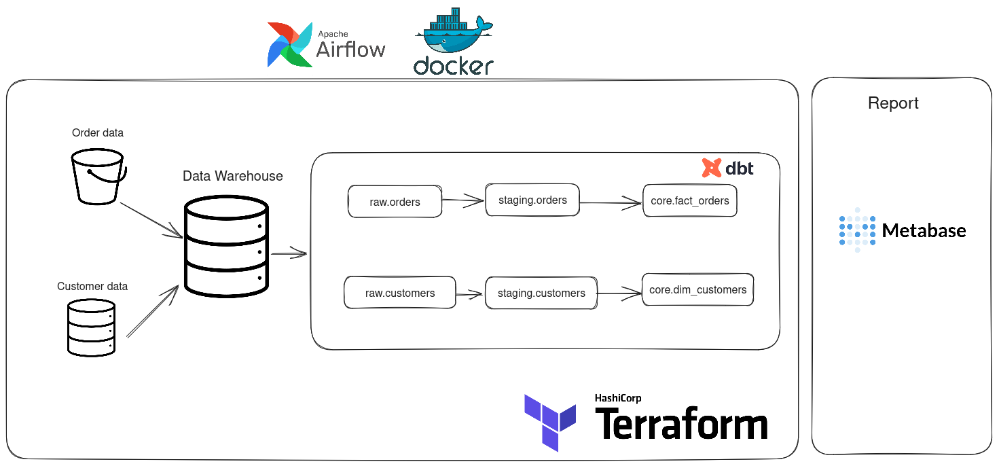

## Overview

The goal of the project is to learn how to run a proper batch data pipeline (ELT pattern)
1. Orchestrate pipeline with Airflow
2. Data modelling with DBT (Kimball Approach)
3. Run data components on cloud with Terrform

Basically, it pulls order data from S3 bucket and customer database ready for analysis. Data is fake by a Docker container which generate data to push to minio and Postgres database. After landing data onto datawarehouse, dbt is used for data modelling.

### Data Architecture

1. Extract customer data from OLTP database and load into to the data warehouse. Order data is pulled from S3 bucket

2. Implement dimensional approach with DBT

3. Serve data with Metabase

4. Orchestrate data pipeline with Airflow

## Prerequisites

Directions or anything needed before running the project.

- Github
- Terraform
- AWS Account
- AWS CLI installed and configured
- Docker with at least 4GB of RAM and Docker Compose v1.27.0 or later

## How to Run This Project

1. git clone https://github.com/trisdoan/dbt_project_1.git
2. cd dbt_project_1
3. make tf-init
4. make infra-up
5. make cloud-airflow (to port forward airflow on cloud to local machine)
6. go to http://localhost:8080/ to trigger dag
7. make cloud-metabase (to port forward metabase on cloud to local machine)
8. make infra-down to destroy data component

## Lessons Learned

I learned so many things during building this project

1. Structure a data project properly
It's hard, extremely for a very first project. I did not how to start.

2. Orchestrate tasks with Airflow
It was totally overwhelming when I started with Airflow. However, jumping to construct a dag from scratch, I gradually got the idea how things works.

3. Utilize Terraform to run project on AWS

4. Use DBT for data modelling

Reference
1. Machado, J. K. (2022, March 18). End-to-end data engineering project - batch edition. Start Data Engineering, from https://www.startdataengineering.com/post/data-engineering-project-e2e/

## Contact

Please feel free to contact me if you have any questions at: 
1. Linkedln: www.linkedin.com/in/trisdoan
2. Email: doanminhtri8183@gmail.com
